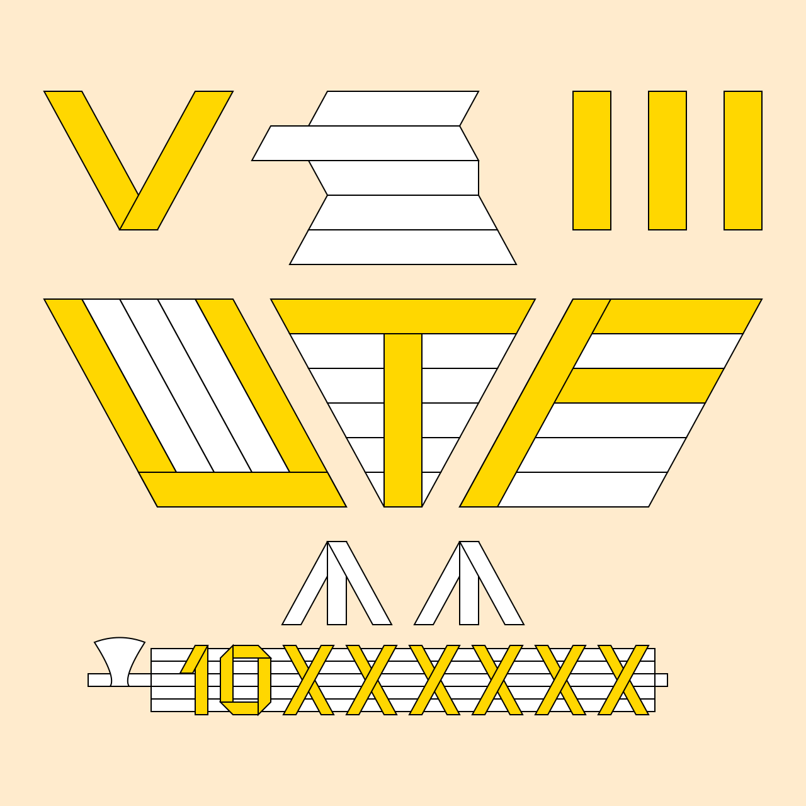
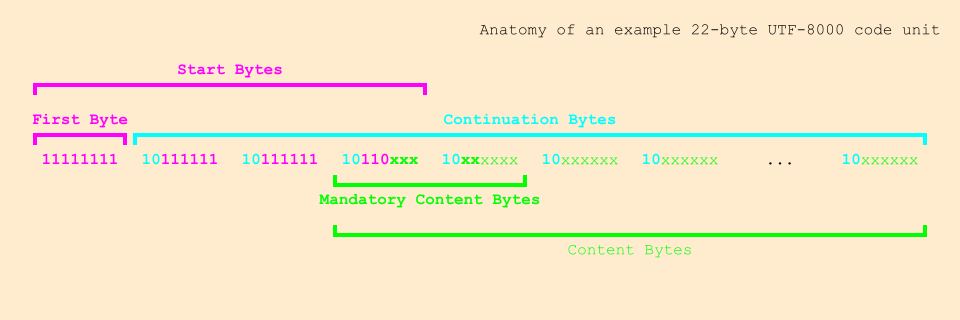

# UTF-8000-Images

Images like my proposed logo(s) for UTF-8000, the favicon used on the [website](https://github.com/UTF-8000/UTF-8000-Website), and some helpful anatomical images.

## License

CC-BY-NC-SA-4.0

## Examples

